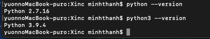
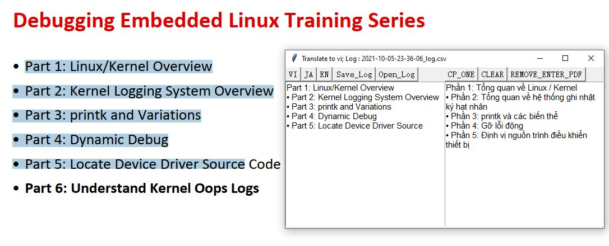

# _clipboard translate google python_

------------------

# A. Setup

## 1. Install Python3.x (If python3 is not installed yet)

- Check if python is installed?
```sh
$ python --version
$ python3 --version
```
 

=> use python3

- If not installed --> Download here https://www.python.org/downloads/

## 2. Install pip3  (If pip3 is not installed yet)

- Check if pip3 is installed?
```sh
$ pip3 --version
```

 

- If not installed --> try this below
```sh
$ curl https://bootstrap.pypa.io/get-pip.py -o get-pip.py
$ python3 get-pip.py
```

## 3. Install pakages from requirement.txt 
```sh
$ cd <Path to Project>
$ pip3 install -r requirements.txt
```

```sh
# for developer : create requirements.txt
$ pipreqs . --force
```

## 4. Install setup from setup.py 
```sh
$ cd <Path to Project>
$ python3 setup.py install
```


# B. Run
## 5. Run and build
1. run by double click main.exe inside dist. (need to do 6. first)
2. using cmd "python3 PATH/main.py" 
3. build by using pycharm, eclipse or something else

## 6. Deploy to application
```sh
$ cd <Path to Project>

#reset
$ rm -rf build/ dist/

# build
$ pyinstaller <Path to src>/main.py

# or
$ pyinstaller pano_app.spec
# or
$ yes | pyinstaller pano_app.spec
```

## Note : Translate google
https://stackoverflow.com/questions/52455774/googletrans-stopped-working-with-error-nonetype-object-has-no-attribute-group

```sh
$ pip install googletrans==3.1.0a0
```

copy any text and it will automatically translate for you
 